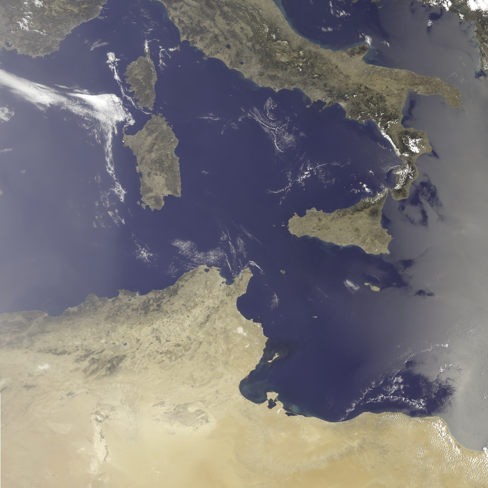
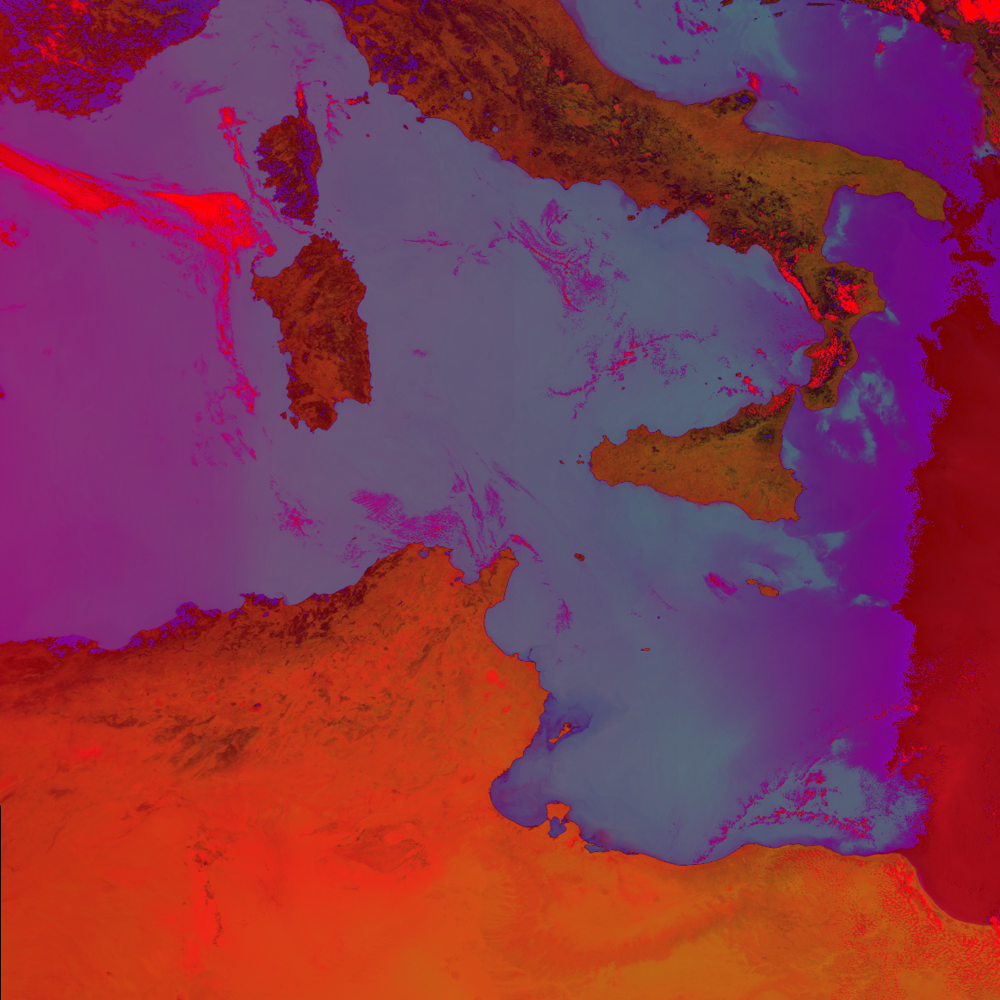
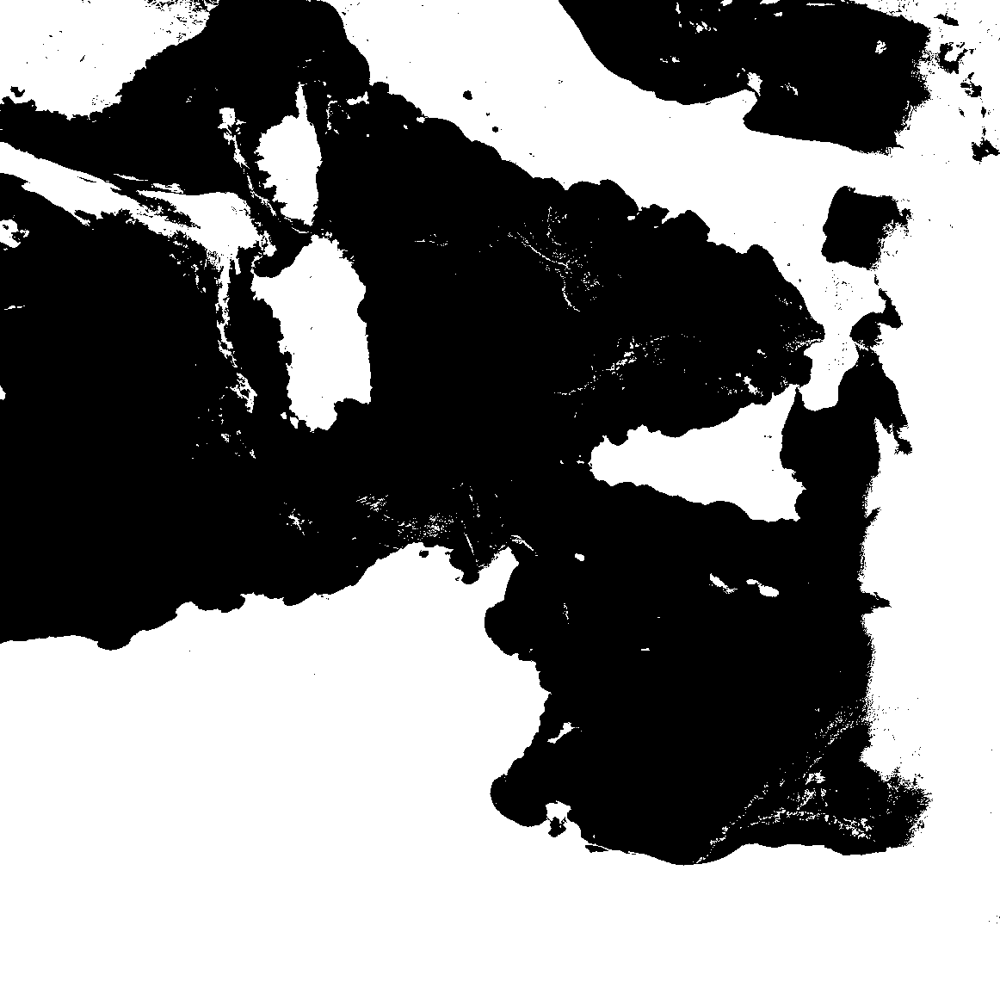
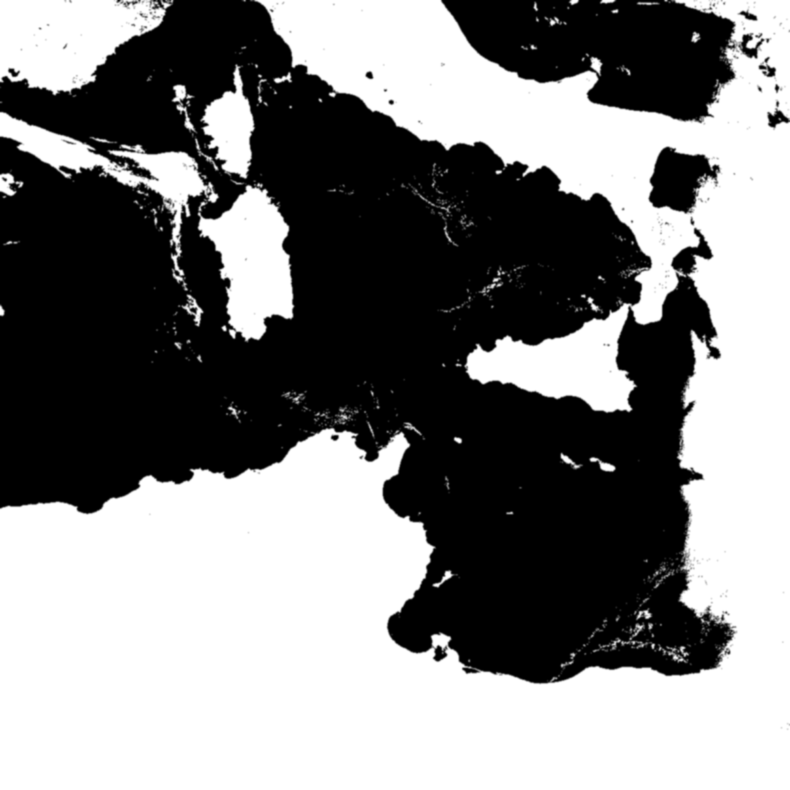
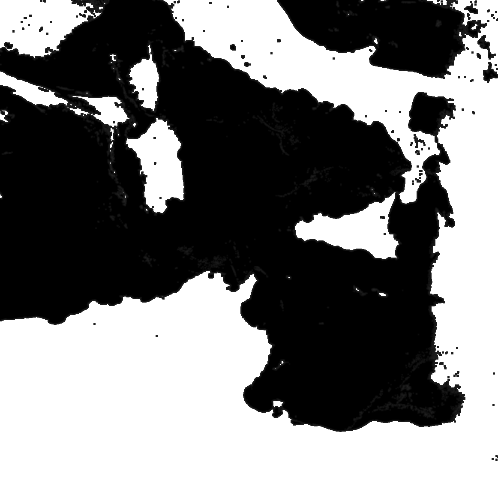
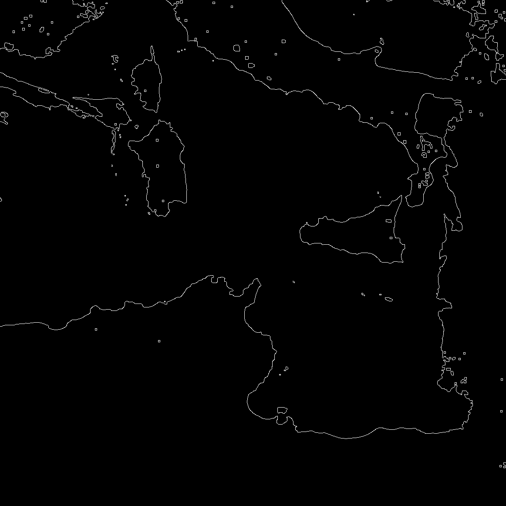
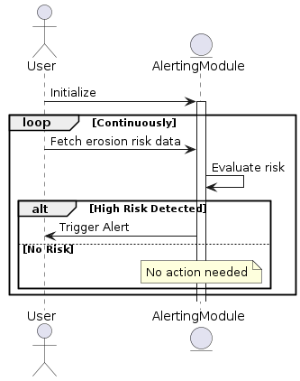

# CARE - Coastal Analysis & Risk Evaluation System

CARE is a system designed to monitor and analyze coastal erosion patterns using data provided by Sentinel-3. The system processes raw images and other telemetries, applies edge detection and other algorithms to recognize erosion patterns, and offers real-time monitoring and alerting functions.

---

## Table of Contents

- [CARE - Coastal Analysis \& Risk Evaluation System](#care---coastal-analysis--risk-evaluation-system)
  - [Table of Contents](#table-of-contents)
  - [Introduction](#introduction)
  - [Documentation: docs folder](#documentation-docs-folder)
  - [Modules: src folder](#modules-src-folder)
    - [User Interface (UI)](#user-interface-ui)
    - [Visualization \& Reporting Module (VRM)](#visualization--reporting-module-vrm)
    - [Data Collection Module (DCM)](#data-collection-module-dcm)
    - [Data Preprocessing Module (DPM)](#data-preprocessing-module-dpm)
    - [Erosion Pattern Analysis Module (EPAM)](#erosion-pattern-analysis-module-epam)
    - [Alerting Module (AM)](#alerting-module-am)
  - [Deployment](#deployment)
    - [Prerequisites](#prerequisites)
    - [Building and Running with Docker Compose](#building-and-running-with-docker-compose)
    - [Data Persistence](#data-persistence)
  - [Design Diagrams](#design-diagrams)
  - [Release Pipeline](#release-pipeline)
  - [License](#license)
  - [Support and Contribution](#support-and-contribution)
  - [Acknowledgments](#acknowledgments)

---

## Introduction

Coastal erosion is a significant global concern, and timely detection and analysis are crucial for proper mitigation. CARE aims to provide a comprehensive solution to analyze and understand erosion patterns using advanced algorithms and visualization techniques.

The primary content of this repository is organized into three main folders:

- [docs folder](./docs) - containing all the documentation.
- [src folder](./src) - source code for the various modules.
- [data folder](./data) - holds input and output data related to our analyses.

---

## Documentation: [docs folder](./docs)

- [Architecture Design Document (ADD)](./docs/Architecture%20Design%20Document%20(ADD).md)
- [System Requirements Document (SRD)](./docs/System%20Requirements%20Document%20(SRD).md)
- [Verification and Validation Plan (VPP)](./docs/Verification%20and%20Validation%20Plan%20(VPP).md)
- [UML](./docs/uml) - UML diagrams that represent system's architecture and flow.
- [images](./docs/images) - visual aids and figures used in the documents.

---

## Modules: [src folder](./src)

The source code is divided based on the language and functionality:

- `cpp` - C++ code, mainly for the alerting and visualization modules.
- `python` - Python scripts, focused on data processing and management.
- `scripts` - Utility scripts.

### User Interface (UI)

- **Status:** _To-Do_ 📝
- **Description:** Enables users to interact with the CARE system. Allows viewing visualizations, setting preferences, and receiving alerts.

### Visualization & Reporting Module (VRM)

- **Status:** _To-Do_ 📝
- **Description:** Generates visualizations and reports based on processed data and analysis. Integrates with the UI to present insights to the user.

### Data Collection Module (DCM)

- **Status:** _To-Do_ 📝
- **Description:** Collects raw images and data from various sources like Sentinel-3 satellites. Interfaces with ground control stations and other data providers.

### Data Preprocessing Module ([DPM](./src/python/dpm))

- **Status:** _In Progress_ 🚧
- **Description:** Preprocesses the collected data through image enhancement, edge detection, and region identification. Ensures data quality for subsequent analysis.

|      Input Image       |      HSV Space      |       Segment       |
|:----------------------:|:-------------------:|:-------------------:|
|  |  |  |

|   Noise Reduction   |      Contrast      |   Edge Detection    |
|:-------------------:|:------------------:|:-------------------:|
|  |  |  |

### Erosion Pattern Analysis Module (EPAM)

- **Status:** _To-Do_ 📝
- **Description:** Analyzes preprocessed data to identify erosion patterns, evaluate risks, and generate analysis results. Integrates with AM and VRM for alerting and visualization.

### Alerting Module ([AM](./src/cpp/am))

- **Status:** _In Progress_ 🚧
- **Description:** Issues alerts for detected high-risk areas. Works closely with EPAM and UI to deliver timely notifications to relevant stakeholders.

**Simplified Workflow**:



---

## Deployment

For a seamless deployment of the CARE system, we utilize Docker Compose, a tool for defining and running multi-container Docker applications.

### Prerequisites

- Ensure Docker and Docker Compose are installed on your machine.
- Navigate to the root directory of the CARE repository.

### Building and Running with Docker Compose

1. **Building the Services:**

    Before running the system for the first time or after any changes, build the services:

    ```bash
    docker compose build
    ```

2. **Starting the Services:**

    To start the CARE services:

    ```bash
    docker compose up
    ```

3. **Stopping the Services:**

    To stop the running services:

    ```bash
    docker compose down
    ```

### Data Persistence

If you have volumes declared to persist data (like processed images, databases, etc.), these will remain even after stopping the services. To clear all data:

```bash
docker compose down -v
```

**Note**: Use this command with caution as it will remove all data stored within the declared volumes.

---

## Design Diagrams

For a detailed understanding of how the modules interact, refer to the [Architecture Design Document (ADD)](./docs/Architecture%20Design%20Document%20(ADD).md).

---

## Release Pipeline

The release pipeline is configured to automatically create a new release of the CARE project, package documentation as PDFs, and attach them to the release. The pipeline can be manually triggered via GitHub Actions, and it ensures that all important documentation and visualizations are packaged together in a structured format, making it easier for users and contributors to access relevant materials.

To trigger the pipeline manually, navigate to the "Actions" tab on the GitHub repository and select the "Create Release" workflow.

---

## License

This project is licensed under the terms of the [license](./LICENSE).

All the images have been downloaded from [Copernicus Open Access Hub](https://scihub.copernicus.eu/dhus/#/home)

---

## Support and Contribution

Feel free to open issues for any bugs or feature requests and contribute through pull requests.

---

## Acknowledgments

Throughout the development of this project, insights from OpenAI's GPT were utilized to enhance aspects of the code, architecture, and documentation.
