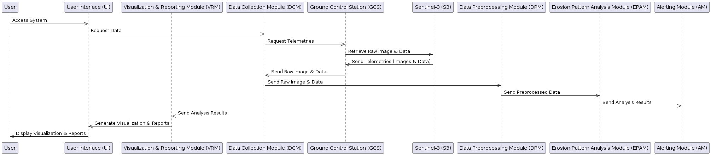
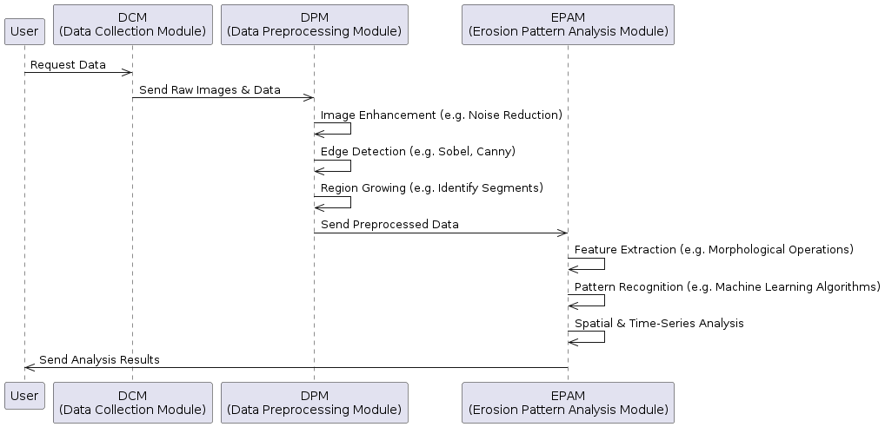
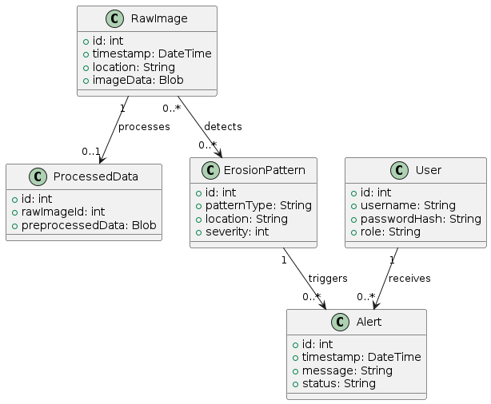
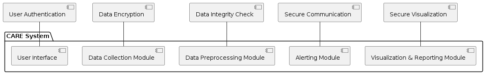

# Architecture Design Document (ADD) for CARE Project

## 1. Introduction

### 1.1 Purpose

This document defines the architecture design for the Coastal Area Risk Evaluation (CARE) system. It serves as a guideline for the development and implementation of the system, describing the key components, their interactions, data flow, security measures, and overall structure. UML diagrams are used to visually represent various aspects of the system.

### 1.2 Scope

The scope of this document covers the design and architectural considerations for the CARE system. It includes detailed descriptions of the system's components and modules, interactions, data design, security policies, and user interfaces. Specific sections are dedicated to presenting visual representations using UML diagrams such as components_interaction, data_pipeline, database, security.

### 1.3 Definitions, Acronyms, and Abbreviations

- **CARE**: Coastal Area Risk Evaluation
- **DCM**: Data Collection Module
- **DPM**: Data Preprocessing Module
- **ECSS**: European Cooperation for Space Standardization
- **EPAM**: Erosion Pattern Analysis Module
- **GCS**: Ground Control Station
- **S3**: Sentinel-3
- **SSH**: Sea Surface Height
- **UI**: User Interface
- **VRM**: Visualization & Reporting Module

## 2. System Overview

### 2.1 System Context

The CARE system is designed to monitor and analyze coastal erosion patterns using SSH data from Sentinel-3 satellites. It retrieves, preprocesses, and analyzes the data, providing real-time monitoring, risk analysis, alerts, and visualizations. The system is structured into several key modules, each responsible for specific functions. Diagrams are provided to depict the overall architecture, data pipeline, database structure, and security measures.

### 2.2 Constraints

The design and development of the CARE system are guided by the following constraints:

- **Regulatory Compliance**: Compliance with ECSS standards and relevant environmental and data privacy regulations.
- **Data Availability**: Dependency on regular and reliable access to Sentinel-3 data and supplemental coastal information.
- **Performance Requirements**: Design to meet specific performance criteria as outlined in the System Requirements Document, including latency, resolution, availability, and security.

## 3. System Architecture

### 3.1 High-Level Architecture

The CARE system's architecture is designed to efficiently process and analyze coastal erosion patterns using SSH data. The architecture is modular, enabling flexibility, maintainability, and scalability. Below are the key layers and components of the system:

- **User Interface (UI)**: Provides the interface for user interaction, allowing access to visualizations, reports, and system settings.
- **Visualization & Reporting Module (VRM)**: Generates visualizations, maps, and reports based on analysis results.
- **Data Processing Layer**: Includes:
  - **Data Collection Module (DCM)**: Responsible for collecting raw images and data from sources like Sentinel-3 satellites.
  - **Data Preprocessing Module (DPM)**: Processes raw data, including image enhancement, edge detection, and region identification.
  - **Erosion Pattern Analysis Module (EPAM)**: Analyzes preprocessed data to detect erosion patterns and assess risks.
- **Alerting Module (AM)**: Issues timely alerts for high-risk areas.
- **Database Layer**: Consists of Raw Image, Processed Data, Erosion Pattern, Alert, and User entities, managing data storage, retrieval, and archiving.
- **Security Layer**: Implements measures such as authentication, encryption, and access control.

### 3.2 Modules Description

#### 3.2.1 User Interface (UI)

The UI enables users to interact with the CARE system. It provides functionalities like viewing visualizations, setting preferences, and receiving alerts.

#### 3.2.2 Visualization & Reporting Module (VRM)

VRM generates visualizations and reports based on processed data and analysis. It integrates with the UI to present these insights to the user.

#### 3.2.3 Data Collection Module (DCM)

DCM collects raw images and data from various sources like Sentinel-3 satellites. It interfaces with ground control stations and other data providers.

#### 3.2.4 Data Preprocessing Module (DPM)

DPM preprocesses the collected data through image enhancement, edge detection, and region identification. It ensures the data quality for subsequent analysis.

#### 3.2.5 Erosion Pattern Analysis Module (EPAM)

EPAM analyzes preprocessed data to identify erosion patterns, evaluate risks, and generate analysis results. It integrates with AM and VRM for alerting and visualization.

#### 3.2.6 Alerting Module (AM)

AM issues alerts for detected high-risk areas. It works closely with EPAM and UI to deliver timely notifications to relevant stakeholders.

### 3.3 Components Interaction

The `Components Interaction Design - Sequence Diagram` details the interaction between various components of the CARE system:

- **User Access**: The user accesses the system through the User Interface (UI).
- **Data Request**: The UI sends a request for data to the Data Collection Module (DCM).
- **Telemetry Request**: DCM requests telemetries from the Ground Control Station (GCS), which in turn retrieves raw images and data from Sentinel-3 (S3).
- **Data Retrieval**: S3 sends telemetries to GCS, which forwards them to DCM. DCM then sends raw images and data to the Data Preprocessing Module (DPM).
- **Data Preprocessing**: DPM preprocesses the data and sends it to the Erosion Pattern Analysis Module (EPAM).
- **Pattern Analysis**: EPAM analyzes the data, sending the analysis results to both the Visualization & Reporting Module (VRM) and the Alerting Module (AM).
- **Alerting**: AM may issue alerts based on the analysis results.
- **Visualization and Reporting**: VRM generates visualizations and reports, which are sent to the UI.
- **Display to User**: Finally, the UI displays the visualization and reports to the user.

These interactions form a coherent flow that allows the system to retrieve, process, analyze, and present data, engaging different modules to perform specific functions.

### 3.4 Data Pipeline Design

The `Data Pipeline Design - Sequence Diagram` offers an insight into the sequential operations and processing techniques that the system employs to analyze coastal erosion patterns. From the initial collection of raw images and data to the final stage of delivering analyzed results, each step is carefully crafted to ensure accuracy and efficiency. It emphasizes the collaboration between the DCM, DPM, and EPAM modules, integrating various computational methods to create a cohesive data analysis pipeline.

- **User to Data Collection**: The user initiates a data request, and the Data Collection Module (DCM) retrieves raw images and data in response.

- **Data Preprocessing**: The Data Preprocessing Module (DPM) takes the raw images and data and applies various preprocessing techniques. This includes:
  - **Image Enhancement**: Techniques such as noise reduction to improve the quality of the images.
  - **Edge Detection**: Methods like Sobel or Canny are used to detect edges within the images.
  - **Region Growing**: Algorithms to identify segments within the images, preparing them for further analysis.

- **Erosion Pattern Analysis**: The preprocessed data is then sent to the Erosion Pattern Analysis Module (EPAM) for detailed analysis. This involves:
  - **Feature Extraction**: Utilizing morphological operations to extract relevant features from the data.
  - **Pattern Recognition**: Applying machine learning algorithms to recognize specific patterns related to coastal erosion.
  - **Spatial & Time-Series Analysis**: Analyzing the spatial distribution and temporal changes in the erosion patterns.

- **Sending Analysis Results**: EPAM sends the final analysis results back to the user, summarizing the identified erosion patterns and associated risks.

### 3.5 Database Design

The `Database Design - Class Diagram` outlines the structure of the database, encompassing tables and relationships among Raw Image, Processed Data, Erosion Pattern, Alert, and User entities.

- **Raw Image**:
  - Stores raw images and data collected from various sources.
  - Has a one-to-one relationship with Processed Data, indicating processing.
  - Has a many-to-many relationship with Erosion Pattern, indicating detections.

- **Processed Data**:
  - Houses the data that has been preprocessed by the DPM.
  - Connected to the Raw Image, associating each processed item with its corresponding raw image.

- **Erosion Pattern**:
  - Contains the results of the erosion pattern analysis performed by the EPAM.
  - Has a one-to-many relationship with Alert, indicating the triggers of alerts.

- **Alert**:
  - Keeps records of alerts generated by the AM.
  - Connected to Erosion Pattern, indicating the cause of the alert.
  - Has a many-to-one relationship with User, who receives these alerts.

- **User**:
  - Manages user profiles and preferences.
  - Associated with the alerts they receive.

### 3.6 Security Design

The `Security Design - Package Diagram` UML diagram highlights the security measures implemented across the system, ensuring confidentiality, integrity, and availability of data and services.

- **Authentication**: Details the mechanisms to authenticate users and administrators, ensuring that only authorized individuals can access the system.
- **Encryption**: Outlines how sensitive data is encrypted both in transit and at rest, using industry-standard encryption protocols.
- **Access Control**: Demonstrates how access to different parts of the system is controlled and restricted based on user roles and permissions.
- **Auditing and Monitoring**: Shows how the system conducts regular security audits and monitors for potential issues, complying with security standards.

### Summary

These diagrams collectively provide a visual and textual overview of the system's architecture, data flow, database design, and security considerations. They enable readers to gain a comprehensive understanding of the structure and functionality of the CARE system.
