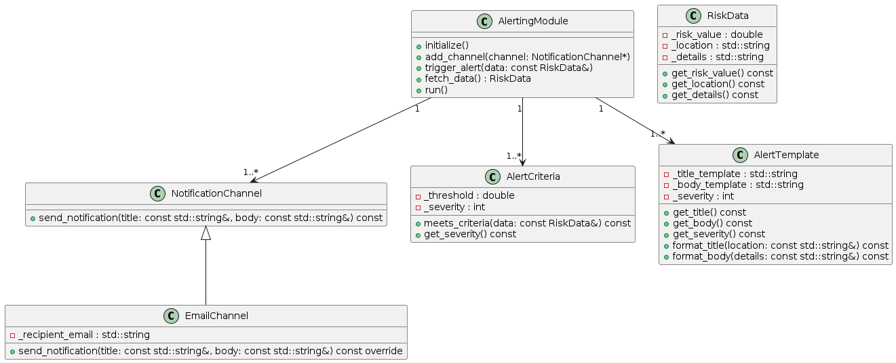
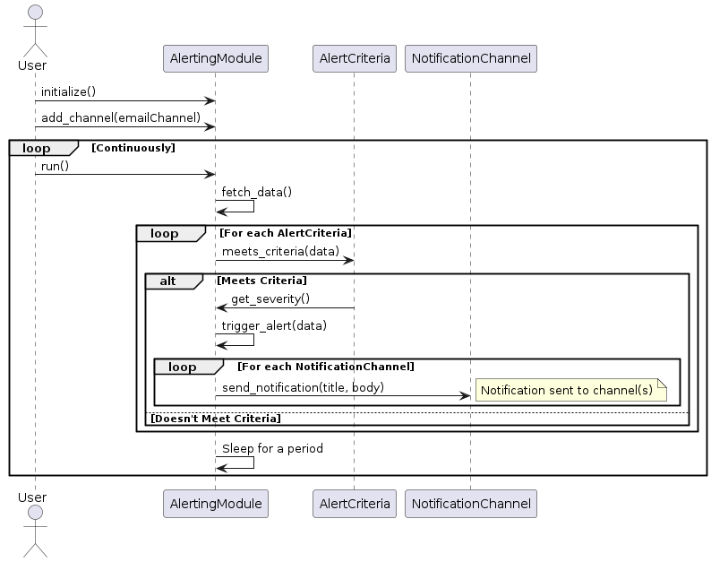
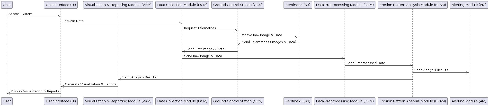
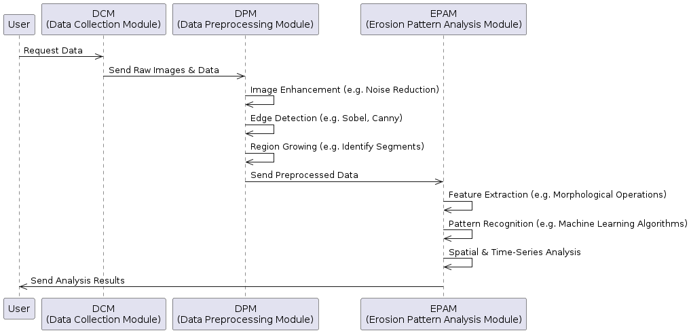
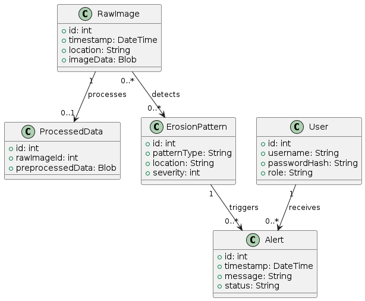
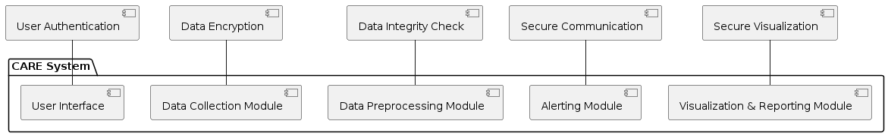
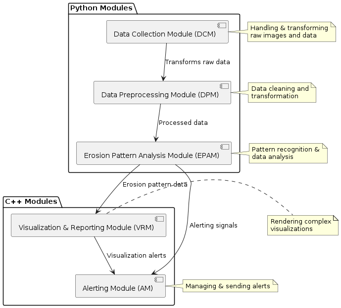

# Architecture Design Document (ADD) - CARE Project <!-- omit in toc -->

## Table of Contents <!-- omit in toc -->

- [1. Introduction](#1-introduction)
  - [1.1 Purpose](#11-purpose)
  - [1.2 Scope](#12-scope)
  - [1.3 Definitions, Acronyms, and Abbreviations](#13-definitions-acronyms-and-abbreviations)
- [2. System Overview](#2-system-overview)
  - [2.1 System Context](#21-system-context)
  - [2.2 Constraints](#22-constraints)
- [3. System Architecture](#3-system-architecture)
  - [3.1 High-Level Architecture](#31-high-level-architecture)
  - [3.2 Modules Description](#32-modules-description)
    - [3.2.1 User Interface (UI)](#321-user-interface-ui)
    - [3.2.2 Visualization \& Reporting Module (VRM)](#322-visualization--reporting-module-vrm)
    - [3.2.3 Data Collection Module (DCM)](#323-data-collection-module-dcm)
    - [3.2.4 Data Preprocessing Module (DPM)](#324-data-preprocessing-module-dpm)
    - [3.2.5 Erosion Pattern Analysis Module (EPAM)](#325-erosion-pattern-analysis-module-epam)
    - [3.2.6 Alerting Module (AM)](#326-alerting-module-am)
  - [3.3 Components Interaction](#33-components-interaction)
  - [3.4 Data Pipeline Design](#34-data-pipeline-design)
  - [3.5 Database Design](#35-database-design)
  - [3.6 Security Design](#36-security-design)
- [4. Technological Stack](#4-technological-stack)
  - [4.1 Programming Languages and Module Distribution](#41-programming-languages-and-module-distribution)
    - [Python](#python)
    - [C++](#c)
    - [Integration Between Python and C++](#integration-between-python-and-c)
    - [Testing and Validation](#testing-and-validation)
    - [Conclusion](#conclusion)
  - [4.2 Version Control](#42-version-control)
    - [GitHub](#github)
  - [4.3 Continuous Integration and Continuous Deployment (CI/CD)](#43-continuous-integration-and-continuous-deployment-cicd)
    - [GitHub Actions](#github-actions)
  - [4.4 Security Measures](#44-security-measures)
- [5. Deployment Strategy](#5-deployment-strategy)
  - [5.1 Overview](#51-overview)
  - [5.2 Environments](#52-environments)
  - [5.3 Deployment Models](#53-deployment-models)
    - [5.3.1 On-Premises Deployment](#531-on-premises-deployment)
    - [5.3.2 Cloud Deployment](#532-cloud-deployment)
  - [5.4 Deployment Tools](#54-deployment-tools)
  - [5.5 Monitoring and Maintenance](#55-monitoring-and-maintenance)
  - [5.6 Security Considerations](#56-security-considerations)
  - [5.7 Disaster Recovery](#57-disaster-recovery)

---

## 1. Introduction

### 1.1 Purpose

This document defines the architecture design for the Coastal Area Risk Evaluation (CARE) system. It serves as a guideline for the development and implementation of the system, describing the key components, their interactions, data flow, security measures, and overall structure. UML diagrams are used to visually represent various aspects of the system.

### 1.2 Scope

The scope of this document covers the design and architectural considerations for the CARE system. It includes detailed descriptions of the system's components and modules, interactions, data design, security policies, and user interfaces. Specific sections are dedicated to presenting visual representations using UML diagrams such as components_interaction, data_pipeline, database, security.

### 1.3 Definitions, Acronyms, and Abbreviations

- **CARE**: Coastal Area Risk Evaluation
- **DCM**: Data Collection Module
- **DPM**: Data Preprocessing Module
- **ECSS**: European Cooperation for Space Standardization
- **EPAM**: Erosion Pattern Analysis Module
- **GCS**: Ground Control Station
- **S3**: Sentinel-3
- **SSH**: Sea Surface Height
- **UI**: User Interface
- **VRM**: Visualization & Reporting Module

---

## 2. System Overview

### 2.1 System Context

The CARE system is designed to monitor and analyze coastal erosion patterns using SSH data from Sentinel-3 satellites. It retrieves, preprocesses, and analyzes the data, providing real-time monitoring, risk analysis, alerts, and visualizations. The system is structured into several key modules, each responsible for specific functions. Diagrams are provided to depict the overall architecture, data pipeline, database structure, and security measures.

### 2.2 Constraints

The design and development of the CARE system are guided by the following constraints:

- **Regulatory Compliance**: Compliance with ECSS standards and relevant environmental and data privacy regulations.
- **Data Availability**: Dependency on regular and reliable access to Sentinel-3 data and supplemental coastal information.
- **Performance Requirements**: Design to meet specific performance criteria as outlined in the System Requirements Document, including latency, resolution, availability, and security.

---

## 3. System Architecture

### 3.1 High-Level Architecture

The CARE system's architecture is designed to efficiently process and analyze coastal erosion patterns using SSH data. The architecture is modular, enabling flexibility, maintainability, and scalability. Below are the key layers and components of the system:

- **User Interface (UI)**: Provides the interface for user interaction, allowing access to visualizations, reports, and system settings.
- **Visualization & Reporting Module (VRM)**: Generates visualizations, maps, and reports based on analysis results.
- **Data Processing Layer**: Includes:
  - **Data Collection Module (DCM)**: Responsible for collecting raw images and data from sources like Sentinel-3 satellites.
  - **Data Preprocessing Module (DPM)**: Processes raw data, including image enhancement, edge detection, and region identification.
  - **Erosion Pattern Analysis Module (EPAM)**: Analyzes preprocessed data to detect erosion patterns and assess risks.
- **Alerting Module (AM)**: Issues timely alerts for high-risk areas.
- **Database Layer**: Consists of Raw Image, Processed Data, Erosion Pattern, Alert, and User entities, managing data storage, retrieval, and archiving.
- **Security Layer**: Implements measures such as authentication, encryption, and access control.

### 3.2 Modules Description

#### 3.2.1 User Interface (UI)

The UI enables users to interact with the CARE system. It provides functionalities like viewing visualizations, setting preferences, and receiving alerts.

#### 3.2.2 Visualization & Reporting Module (VRM)

VRM generates visualizations and reports based on processed data and analysis. It integrates with the UI to present these insights to the user.

#### 3.2.3 Data Collection Module (DCM)

DCM collects raw images and data from various sources like Sentinel-3 satellites. It interfaces with ground control stations and other data providers.

#### 3.2.4 Data Preprocessing Module (DPM)

DPM preprocesses the collected data through image enhancement, edge detection, and region identification. It ensures the data quality for subsequent analysis.

#### 3.2.5 Erosion Pattern Analysis Module (EPAM)

EPAM analyzes preprocessed data to identify erosion patterns, evaluate risks, and generate analysis results. It integrates with AM and VRM for alerting and visualization.

#### 3.2.6 Alerting Module (AM)

AM issues alerts for detected high-risk areas. It works closely with EPAM and UI to deliver timely notifications to relevant stakeholders.

### 3.3 Components Interaction

The `Components Interaction Design - Sequence Diagram` details the interaction between various components of the CARE system:

- **User Access**: The user accesses the system through the User Interface (UI).
- **Data Request**: The UI sends a request for data to the Data Collection Module (DCM).
- **Telemetry Request**: DCM requests telemetries from the Ground Control Station (GCS), which in turn retrieves raw images and data from Sentinel-3 (S3).
- **Data Retrieval**: S3 sends telemetries to GCS, which forwards them to DCM. DCM then sends raw images and data to the Data Preprocessing Module (DPM).
- **Data Preprocessing**: DPM preprocesses the data and sends it to the Erosion Pattern Analysis Module (EPAM).
- **Pattern Analysis**: EPAM analyzes the data, sending the analysis results to both the Visualization & Reporting Module (VRM) and the Alerting Module (AM).
- **Alerting**: AM may issue alerts based on the analysis results.
- **Visualization and Reporting**: VRM generates visualizations and reports, which are sent to the UI.
- **Display to User**: Finally, the UI displays the visualization and reports to the user.

These interactions form a coherent flow that allows the system to retrieve, process, analyze, and present data, engaging different modules to perform specific functions.

### 3.4 Data Pipeline Design

The `Data Pipeline Design - Sequence Diagram` offers an insight into the sequential operations and processing techniques that the system employs to analyze coastal erosion patterns. From the initial collection of raw images and data to the final stage of delivering analyzed results, each step is carefully crafted to ensure accuracy and efficiency. It emphasizes the collaboration between the DCM, DPM, and EPAM modules, integrating various computational methods to create a cohesive data analysis pipeline.

- **User to Data Collection**: The user initiates a data request, and the Data Collection Module (DCM) retrieves raw images and data in response.

- **Data Preprocessing**: The Data Preprocessing Module (DPM) takes the raw images and data and applies various preprocessing techniques. This includes:
  - **Image Enhancement**: Techniques such as noise reduction to improve the quality of the images.
  - **Edge Detection**: Methods like Sobel or Canny are used to detect edges within the images.
  - **Region Growing**: Algorithms to identify segments within the images, preparing them for further analysis.

- **Erosion Pattern Analysis**: The preprocessed data is then sent to the Erosion Pattern Analysis Module (EPAM) for detailed analysis. This involves:
  - **Feature Extraction**: Utilizing morphological operations to extract relevant features from the data.
  - **Pattern Recognition**: Applying machine learning algorithms to recognize specific patterns related to coastal erosion.
  - **Spatial & Time-Series Analysis**: Analyzing the spatial distribution and temporal changes in the erosion patterns.

- **Sending Analysis Results**: EPAM sends the final analysis results back to the user, summarizing the identified erosion patterns and associated risks.

### 3.5 Database Design

The `Database Design - Class Diagram` outlines the structure of the database, encompassing tables and relationships among Raw Image, Processed Data, Erosion Pattern, Alert, and User entities.

- **Raw Image**:
  - Stores raw images and data collected from various sources.
  - Has a one-to-one relationship with Processed Data, indicating processing.
  - Has a many-to-many relationship with Erosion Pattern, indicating detections.

- **Processed Data**:
  - Houses the data that has been preprocessed by the DPM.
  - Connected to the Raw Image, associating each processed item with its corresponding raw image.

- **Erosion Pattern**:
  - Contains the results of the erosion pattern analysis performed by the EPAM.
  - Has a one-to-many relationship with Alert, indicating the triggers of alerts.

- **Alert**:
  - Keeps records of alerts generated by the AM.
  - Connected to Erosion Pattern, indicating the cause of the alert.
  - Has a many-to-one relationship with User, who receives these alerts.

- **User**:
  - Manages user profiles and preferences.
  - Associated with the alerts they receive.

### 3.6 Security Design

The `Security Design - Package Diagram` UML diagram highlights the security measures implemented across the system, ensuring confidentiality, integrity, and availability of data and services.

- **Authentication**: Details the mechanisms to authenticate users and administrators, ensuring that only authorized individuals can access the system.
- **Encryption**: Outlines how sensitive data is encrypted both in transit and at rest, using industry-standard encryption protocols.
- **Access Control**: Demonstrates how access to different parts of the system is controlled and restricted based on user roles and permissions.
- **Auditing and Monitoring**: Shows how the system conducts regular security audits and monitors for potential issues, complying with security standards.

These diagrams collectively provide a visual and textual overview of the system's architecture, data flow, database design, and security considerations. They enable readers to gain a comprehensive understanding of the structure and functionality of the CARE system.

---

## 4. Technological Stack

### 4.1 Programming Languages and Module Distribution

#### Python

The CARE system utilizes Python as one of its core programming languages. Python is employed in various modules, including the Data Collection Module (DCM), Data Preprocessing Module (DPM), and Erosion Pattern Analysis Module (EPAM). The selection of Python is due to its rich library support, especially for scientific computing, and its flexibility in data manipulation and analysis.

- **Version**: Python 3.8
- **Libraries**: NumPy, SciPy, Pandas, Scikit-Learn
- **Usage**:
  - **Data Collection and Preprocessing**: Handling and transforming raw images and data.
  - **Pattern Analysis**: Implementing machine learning models for erosion pattern recognition.

The modules will be:

1. **Data Collection Module (DCM)**:
   - Handling Raw Images and Data

2. **Data Preprocessing Module (DPM)**:
   - Data Cleaning and Transformation
   - Feature Extraction

3. **Erosion Pattern Analysis Module (EPAM)**:
   - Pattern Recognition
   - Data Analysis

#### C++

C++ is leveraged in the Visualization & Reporting Module (VRM) and Alerting Module (AM). Chosen for its performance efficiency and robustness, C++ enables the system to generate real-time visualizations and alerts.

- **Version**: C++17
- **Libraries**: OpenGL for visualization, Boost for enhanced functionality
- **Usage**:
  - **Visualization**: Rendering complex visualizations of erosion patterns.
  - **Alerting**: Managing and sending alerts with low latency.

The modules will be:

1. **Visualization & Reporting Module (VRM)**:
   - Rendering Complex Visualizations
   - Generating Reports

2. **Alerting Module (AM)**:
   - Managing Alerts

#### Integration Between Python and C++

- **Data Exchange**: Defining a mechanism for data exchange between Python and C++ modules.
- **Interface Design**: Creating well-defined interfaces or APIs.
- **Error Handling**: Implementing robust error handling and logging mechanisms.

#### Testing and Validation

- **Unit Testing**: Writing unit tests using appropriate frameworks.
- **Integration Testing**: Designing integration tests to ensure seamless communication.

#### Conclusion

The mixed approach between Python and C++ enables the CARE system to utilize the best features of both languages. Python's rich library support facilitates scientific computing, while C++'s performance efficiency ensures real-time response. Careful planning for integration, comprehensive testing, and adherence to best practices in both languages are essential for the successful implementation.

### 4.2 Version Control

#### GitHub

The CARE system's codebase is hosted on GitHub, providing a centralized repository for collaborative development. GitHub offers version control, issue tracking, code review, and integration with various tools, including GitHub Actions for CI/CD.

- **Repository Structure**: Separate branches for development, staging, and production.
- **Collaboration**: Use of pull requests, code reviews, and issues to manage development work.
- **Access Control**: Role-based access control to ensure only authorized personnel can make changes to specific parts of the codebase.

### 4.3 Continuous Integration and Continuous Deployment (CI/CD)

#### GitHub Actions

GitHub Actions is used for the CARE system's CI/CD pipeline. It automates the build, test, and deployment processes, ensuring that the codebase remains robust and that new changes are smoothly integrated.

- **Build**: Automated build processes for both Python and C++ components.
- **Testing**: Running unit tests, integration tests, and other quality checks.
- **Deployment**: Automatic deployment to various environments based on the branch being merged.
- **Monitoring and Logging**: Continuous monitoring of the application's performance and automatic logging of key events.

### 4.4 Security Measures

The CARE system implements various security measures to protect the integrity, confidentiality, and availability of the data and services.

- **Code Review**: Regular code reviews on GitHub to identify and rectify potential security vulnerabilities.
- **Static Analysis**: Utilizing static analysis tools the codebase is routinely scanned for potential security risks and programming errors.
- **Encryption**: Usage of encryption protocols to secure data both in transit and at rest.
- **Authentication and Authorization**: Implementing role-based access control within the GitHub repository and across different parts of the system.
- **Security Scanning**: Integration of automated security scanning tools with GitHub Actions to continuously analyze the codebase for known security vulnerabilities.
- **Compliance**: Adherence to relevant security standards and regulations, ensuring that the system meets legal and industry-specific requirements.

---

## 5. Deployment Strategy

### 5.1 Overview

The deployment strategy for the CARE system is designed to ensure efficient distribution, management, and operation of the system's various components across multiple environments. It considers factors like scalability, availability, security, and compliance with relevant regulations.

### 5.2 Environments

The CARE system will be deployed across three main environments to support the development lifecycle:

- **Development Environment**: For continuous development, testing, and integration of new features and changes.
- **Staging Environment**: For testing the system in a setup that mimics the production environment, allowing for final checks and validations before release.
- **Production Environment**: For the live version of the system, accessible by end-users and stakeholders.

### 5.3 Deployment Models

#### 5.3.1 On-Premises Deployment

Certain components, like the Data Collection Module (DCM) and data-sensitive processes, will be hosted on-premises to ensure compliance with data privacy regulations and to meet performance requirements.

#### 5.3.2 Cloud Deployment

Non-sensitive modules, like the Visualization & Reporting Module (VRM) and User Interface (UI), will be deployed on the cloud to ensure scalability and ease of access.

### 5.4 Deployment Tools

- **Containers**: Docker will be used to containerize individual components, ensuring consistency across different environments.
- **Orchestration**: Kubernetes will be employed to manage and scale the containerized components, providing automated deployment, scaling, and operations of application containers.
- **Continuous Integration/Continuous Deployment (CI/CD)**: GitHub Actions will be leveraged for automated building, testing, and deployment of the system, enabling a seamless development workflow.

### 5.5 Monitoring and Maintenance

- **Monitoring**: Tools like Prometheus and Grafana will be integrated for real-time monitoring of the system's performance, health, and usage.
- **Maintenance**: Regular maintenance schedules will be established, and automation tools will be employed to handle updates, backups, and other routine tasks.

### 5.6 Security Considerations

- **Secure Communication**: All communication between different components and environments will be encrypted using protocols like TLS.
- **Access Control**: Role-based access control (RBAC) will be implemented to restrict access to different parts of the system based on user roles and permissions.
- **Compliance**: All deployment strategies will adhere to relevant regulatory requirements, such as ECSS standards.

### 5.7 Disaster Recovery

A comprehensive disaster recovery plan will be put in place, including:

- **Backup and Restore**: Regular backups of critical data and configurations, with well-defined procedures for restoration.
- **Failover Strategies**: Implementation of failover mechanisms to ensure high availability in case of component failure.

The deployment strategy for the CARE system has been carefully crafted to align with the system's architectural design, performance requirements, and regulatory compliance. By employing modern deployment practices and tools, it seeks to provide a robust, scalable, and secure foundation for the efficient operation of the system.

---
